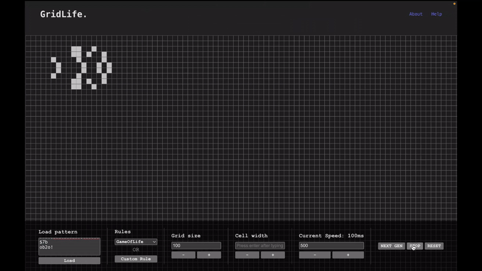

# Cellular Automaton Simulatior

This project implements a cellular automaton simulation using React, allowing users to observe fascinating patterns emerge and evolve within a grid-based environment.

## Key Features

- **Visualization**: Watch captivating patterns unfold as the simulation progresses.
- **Interactive Controls**: Toggle cell states using `Ctrl + click` and apply bulk edits (brush mode) using `Ctrl + Alt`.
- **Customizable Speed**: Control the simulation speed by specifying the time interval in milliseconds.
- **Pattern Loading**: Load patterns directly from [conwaylife.com](https://www.conwaylife.com/) by copying and pasting the RLE (Run Length Encoded) string of any pattern.
- **Custom Rule Wizard**: Customize the rule set using the built-in Custom Rule Wizard to experiment with different cellular automaton rules.

## Technologies Used

- **Vite**: Next-generation frontend build tooling for rapid development.
- **React**: JavaScript library for building interactive user interfaces.
- **Web Workers**: Leveraging web workers to compute the next generation of the cellular automaton in a separate thread, improving performance and responsiveness.

## Getting Started

To run this project locally, follow these steps:
1. Clone the repository to your local machine.
2. Install project dependencies using `npm install`.
3. Start the development server with `npm run dev`.
4. Access the simulation in your web browser at `http://localhost:5173`.

## Contributions

Contributions are welcome! If you have ideas for improvements or feature enhancements, feel free to open an issue or submit a pull request.

## License

This project is licensed under the MIT License - see the [LICENSE](LICENSE) file for details.

## Acknowledgements

Special thanks to [The Coding Train](https://www.youtube.com/c/TheCodingTrain) for the helpful tutorial on cellular automaton simulations ([Watch Video](https://www.youtube.com/watch?v=ygdPRlSo3Qg)). Portions of the code and concepts in this project were inspired by their work.

This project was inspired by the fascinating concepts of cellular automata and is developed for educational and experimental purposes.

